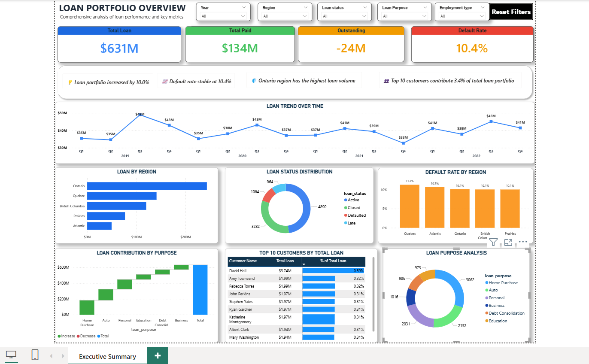
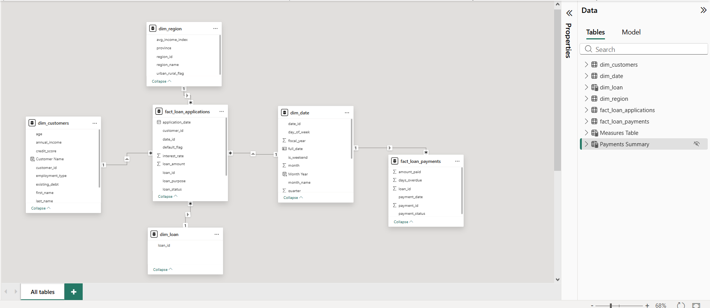

**# Loan Portfolio Analytics Dashboard**

This repository showcases an end-to-end Business Intelligence solution built using SQL Server and Power BI. It demonstrates data modeling, SQL analytics, DAX calculations, KPI reporting, and interactive dashboard development to deliver executive-level insights into loan portfolio performance, customer behavior, regional lending trends, and default risk..

**## 📌 Project Overview**

This repository showcases an end-to-end Business Intelligence solution built using SQL Server and Power BI. It demonstrates data modeling, SQL analytics, DAX calculations, KPI reporting, and interactive dashboard development to deliver executive-level insights into loan portfolio performance, customer behavior, regional lending trends, and default risk..

\---

**## 🛠️ Tools Used**

\* SQL Server (SSMS)

\* Power BI

\* DAX

\* Data Modeling

\---

**## 📊 Dashboard Features**

\* Total Loan KPI

\* Total Paid KPI

\* Outstanding Loan Analysis

\* Default Rate Analysis

\* Loan Trend Over Time

\* Regional Loan Distribution

\* Loan Purpose Analysis

\* Top Customer Analysis

\* Dynamic Insight Cards

\* Interactive Slicers \& Filters

\---

\## 🗂️ **Data Model**

The project follows a Star Schema model using:

\* Fact Loan Applications

\* Fact Loan Payments

\* Dim Customers

\* Dim Region

\* Dim Date

\---

\## 🧮 **SQL Analysis Included**

\* Loan aggregation queries

\* Default rate analysis

\* Regional loan analysis

\* Customer ranking queries

\* Loan trend analysis

\---

**## 📷 Dashboard Preview**

## Dashboard Preview

## Star Schema

\---

**## 🚀 Key Learnings**

\* Advanced DAX calculations

\* Data modeling using star schema

\* Interactive dashboard design

\* Dynamic business insights in Power BI

\* SQL-based business analysis

